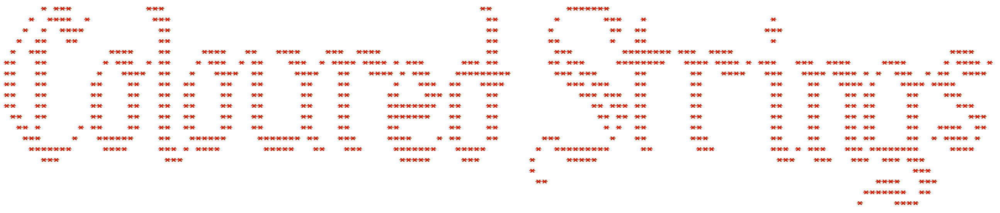

# coloured-strings

Rust crate that allows coloured strings to be printed to the terminal with the smallest file size neccessary.
```rust
  colour("this is a green string", "green");
  colour("this is a red string", "r");
  colour("this is a string with a strikethrough", "s")
  color(&colour("this string has white text and a blue background", w")[..], "b-bl"));
```
## How to Use
Include "coloured_strings" in your project (I recommend you use "*")
```rust
use coloured_strings::*;

fn main() {
    println!("{}", colour("I love coloured text!", "brightgreen");
}
```


## Current Colours
 ```rust
    // normal colours
     "black" | "b"
     "red" | "r"
     "green" | "g"
     "yellow" | "y"
     "blue" | "bl"
     "magenta" | "m"
     "cyan" | "c"
     "white"| "w"

     // bright colours
     "brightblack" | "bb"
     "brightred" | "br"
     "brightgreen" | "bg"
     "brightyellow" | "by"
     "brightblue" | "bbl"
     "brightmagenta" | "bm"
     "brightcyan" | "bc"
     "brightwhite" | "bw"

     //background colours
     "backgroundred" | "b-r"
     "backgroundgreen" | "b-g"
     "backgroundyellow" | "b-y"
     "backgroundblue" | "b-b"
     "backgroundmagenta" | "b-m"
     "backgroundcyan" | "b-c"
     "bacgroundwhite" | "b-w"

     //bright background colours
     "backgroundbrightblack" | "b-bb"
     "backgroundbrightred" | "b-br"
     "backgroundbrightgreen" | "b-bg"
     "backgroundbrightyellow" | "b-by"
     "backgroundbrightblue" | "b-bbl"
     "backgroundbrightmagenta" | "b-bm"
     "backgroundbrightcyan" | "b-bc"
     "backgroundbrightwhite" | "b-bw"

    // other styles
     "clear" | "cl"
     "dimmed" | "d"
     "italic" | "i"  
     "underline" | "u"
     "blink" | "bli"  
     "reversed" | "re"
     "hidden" | "h"
     "strikethrough" | "s"
```

